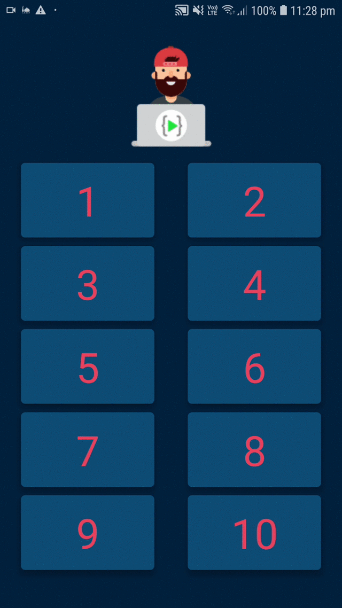

# SpanishNumber

Build using React native 
An audio app which helps you in learn the pronunciation of Numbers from 1 to 10 in spanish. 

Tapping on the number tiles will output a voice note which pronounces the number in spanish  
Easy and fun to learn :)

  

